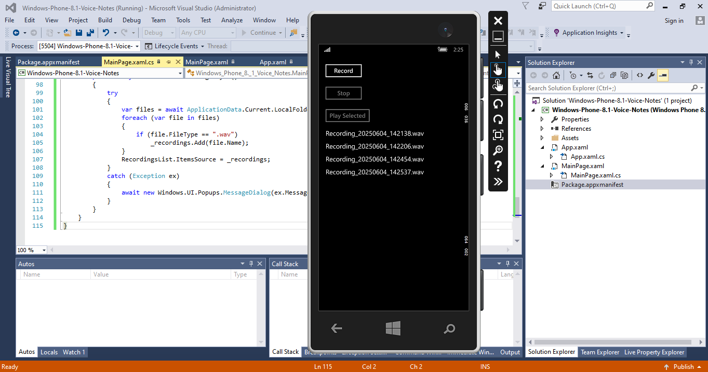

# Windows Phone 8.1 Voice Notes

A simple Windows Phone 8.1 app for recording, saving, and playing back audio notes. Built with C# and XAML in Visual Studio 2015, it offers a straightforward interface for managing voice recordings.

[](https://www.gnu.org/licenses/gpl-3.0)

## Table of Contents
- [Features](#features)
- [Screenshots](#screenshots)
- [Requirements](#requirements)
- [Setup Instructions](#setup-instructions)
- [Usage](#usage)
- [Project Structure](#project-structure)
- [Contributing](#contributing)
- [License](#license)

## Features
- **Record Audio**: Capture notes using the device's microphone.
- **Save Recordings**: Store audio as WAV files in local storage.
- **Playback**: List and play back saved recordings with ease.

## Screenshots
| Main Screen | 
|-------------|
|  |

## Requirements
- Windows Phone 8.1 device or emulator.
- Visual Studio 2015 with Windows Phone 8.1 SDK.
- Microphone capability enabled in `Package.appxmanifest`.

## Setup
1. Clone the repository:
   ```bash
   git clone https://github.com/johnkoshy/Windows-Phone-8.1-Voice-Notes.git
2. Open the solution file (Windows-Phone-8.1-Voice-Notes.sln) in Visual Studio 2015.
3. Ensure the Microphone capability is enabled in Package.appxmanifest.
4. Build and deploy the app to a Windows Phone 8.1 emulator or device.

## Usage

1. Launch the app on your Windows Phone 8.1 device.
2. Tap Record to start capturing audio.
3. Tap Stop to save the recording.
4. Select a recording from the list and tap Play Selected to listen.

## Project Structure
- **MainPage.xaml**: Main interface for recording and playback.
- **Package.appxmanifest**: Configuration file with microphone permissions.
- **Assets/**: App icons and tile images.
- **Screenshots/**: Stores app screenshots.

## Contributing
Contributions are welcome! Please submit a pull request or open an issue on GitHub for suggestions or bug reports.

## License
This project is licensed under the [GNU General Public License v3.0](LICENSE).